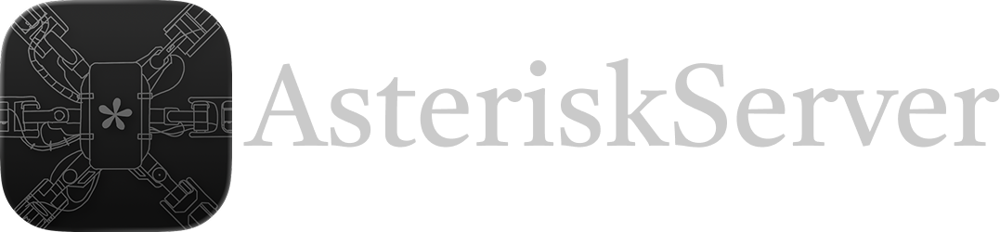
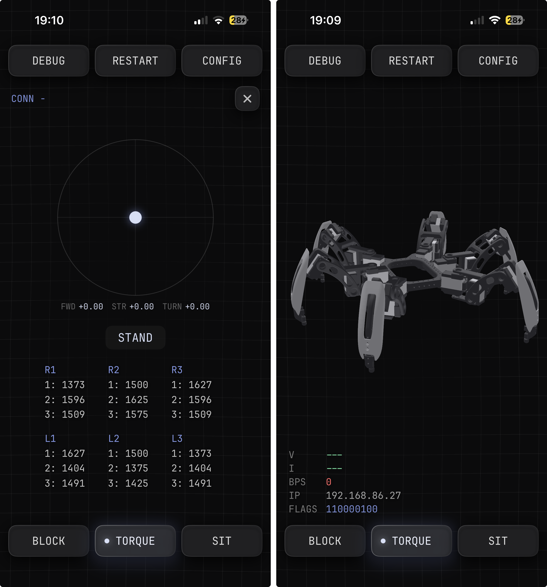

<div align="center">
  
  
</div>
<div align="center"><i>"open source forever"</i></div>

# AsteriskServer
a faithful reconstruction and port of Chica Server by Make Your Pet, an all-in-one hexapod controller app designed for Chica, Chipo, and other 3DOF hexapods, to iOS. alongside the reconstructed source, I've included the tools I used to make the process a little easier. if you find issues with the app, open an issue so it can be reviewed and fixed.

## Overview

AsteriskServer turns an iPhone into the brain of a hexapod. the phone runs the
server, drives the legs over USB Ethernet, reads its own motion sensors for tilt, and
takes commands over the network from any client.

```
   ┌──────────┐    TCP / Wi-Fi     ┌───────────────────┐    USB Ethernet   ┌───────────────┐
   │  client  │ ─────────────────► │   AsteriskServer  │ ────────────────► │   Servo2040   │
   │ (app or  │     port 18711     │     (iPhone)      │    192.168.204.2  │ 192.168.204.1 │
   │  script) │ ◄───────────────── │                   │ ◄──────────────── │   18 servos   │
   └──────────┘    status lines    └───────────────────┘     telemetry     └───────────────┘
```

so there are really two conversations going on, and each gets its own section below:

| layer | how it talks | section |
| :---- | :----------- | :------ |
| client → server | TCP lines or WebSocket text frames | [Client Communication](#client-communication) |
| server → hardware | compact byte protocol over USB Ethernet / TCP | [Hardware Communication](#hardware-communication) |
## Screenshots



## Getting Started

AsteriskServer runs on the iPhone, and the hexapod's control board plugs straight into
that phone.

1. **install the app** grab a release IPA and sideload or [build it in Xcode](#building) and run it on the iPhone
   that'll live on the robot. you'll need an iPhone 15 or later on iOS 17 or newer. the current Xcode
   project installs the app as **AsteriskServer**.
2. **connect the board** flash the Servo2040 with the [bundled USB Ethernet firmware](firmware/chica_servo2040_usbnet.uf2), then
   plug it into the iPhone with a USB data cable or a suitable USB host adapter.
   open the app and allow **Local Network** access when iOS asks.
3. **connect a client** the phone now listens on TCP port **`18711`** over your
   Wi-Fi. point a controller client at `‹phone-ip›:18711`, or use WebSocket on
   `ws://‹phone-ip›:18710`. you can also poke it by hand:

   ```bash
   nc ‹phone-ip› 18711
   # → ready:BPS= 92|V= 7.980|I= 0.250|IP=192.168.1.50|LEGS=------|FLAGS=110000100
   ack           # read status
   walk2:0,0.3,0 # walk forward
   walkclear     # stop
   sit           # sit back down
   ```

> [!TIP]
> the board's geometry, servo calibration, pin map, and gait modes all live in
> [`ChicaConfig.swift`](AsteriskServer/ChicaConfig.swift), and you can edit them
> live from the in-app **CONFIG** dialog. changes are saved to `chica.config`.

keep the app in the foreground while using it. startup enables torque and stands
the robot, so check the config before powering the servos. **DEBUG** shows the
client's walk joystick, active movement, connection type, and per-leg PWM values.

## Client Communication

the client talks to the server over a plain-text, line-based **TCP** socket on port
**`18711`** (it binds every interface, so it's reachable over Wi-Fi).
WebSocket clients use port **`18710`**, with the same commands and status replies
carried in text frames.

**handshake & flow**

- on connect, the server sends a single **status line** (described below).
- the client sends one **command per line** (`\n`-terminated) over TCP, or one
  command per WebSocket text frame.
- after each command the server replies with a status line, prefixed by:

  | prefix   | meaning |
  | :------- | :------ |
  | `ready:` | current status; asynchronous movement may still be running |
  | `busy:`  | another command is being processed, just send it again later |

- `ack` polls status and can trigger the original home / auto-sit behavior.
  `bye` requests a walk stop and closes the connection.

**status line**

```
ready:BPS= 92|V= 7.980|I= 0.250|IP=192.168.1.50|LEGS=------|FLAGS=110000100
```

| field   | meaning |
| :------ | :------ |
| `BPS`   | successful communication cycles per second over the USB Ethernet link |
| `V`     | battery voltage (`---` when there's no telemetry) |
| `I`     | current draw in amps (`---` when there's no telemetry) |
| `IP`    | the server's own IP address |
| `LEGS`  | per-leg foot contact, L1 through R3, 6 chars (`x` = touching, `-` = lifted) |
| `FLAGS` | 9 state digits (see below) |

`FLAGS`, left to right: `relay` · `standing` · `keep` · `crab` · `mode` · `level` ·
`autoSit` · `block` · `calibPosition`. so `110000100` means powered and standing,
in mode 0, with autoSit on.

**command reference**

| group | commands | notes |
| :---- | :------- | :---- |
| power & posture | `torque`, `sit`, `home`, `keep`, `autosit`, `block` | most of these are toggles |
| movement | `walk:` · `walk1:` · `walk15:` · `walk2:` · `walk25:` · `walk3:` · `walkwave:`, `walkclear`, `crab` | gait variants plus a stop |
| body pose | `setxy:` · `setzu:` · `setvw:` · `setxyvw:` · `setrotate:` · `setdive:`, `setclear` | translate / rotate the body |
| modes | `standard`, `race`, `offroad`, `custom`, `quad:‹leg›,‹leg›` | quad selects two legs to tuck, indices 0–5 (L1 through R3) |
| calibration | `calibpos`, `calibrate` | calibration pose, and auto-calibrate |
| effects | `bounce`, `jump`, `beep`, `level`, `clear` | |
| system | `reboot`, `restart` | `restart` restarts the local service; `reboot` requests torque off and logs the request |

the parametric ones take comma-separated values, e.g. `walk2:‹turn›,‹forward›,‹anim›`
and `setxy:‹x›,‹y›`. velocity and pose inputs are unit-scaled, and the body vectors
are clamped to the unit circle. the walk animation field is an integer; in crab
mode, the first walk value controls strafe.

## Hardware Communication

the server drives the legs over **USB Ethernet**. the Servo2040 firmware presents
the board as a wired network device, gives the phone a local IP address through
DHCP (usually **`192.168.204.2`**), and listens at **`192.168.204.1:18712`**.
the app opens a TCP connection to that endpoint and sends the servo byte frames
through it. all of this travels over the USB cable.

you'll need the **[`chica_servo2040_usbnet.uf2`](firmware/chica_servo2040_usbnet.uf2)** firmware build. the stock
serial-only firmware doesn't expose that endpoint. the combined USB Ethernet
firmware also provides a serial interface for the Android server. the ready-to-flash
UF2 and its [source](firmware/source/) are bundled in [`firmware/`](firmware/README.md),
with instructions for flashing and rebuilding it.

this port supports Servo2040 over USB Ethernet. direct USB serial, Pololu boards,
and secondary-board config pins aren't implemented.

servo targets are staged and flushed by one heartbeat, which also polls
telemetry. BPS measures successful board communication, not the visualizer's
frame rate. if the board first connects after an unsuccessful startup connection,
the app restarts its service to initialize the robot with the hardware present.

**frame protocol**

| command | byte form | purpose |
| :------ | :-------- | :------ |
| `SET` | `0xD3 …` | write servo pulse targets (14-bit ×18) and digital outputs (the power relay) |
| `GET` | `0xC7 ‹pin› ‹count›` | read analog pins; the reply echoes `0xC7 ‹pin› ‹count›` then `count` 14-bit values (`low7`, `high7`) |

**servos** 18 servos, which is 3 joints across 6 legs. a joint angle turns into a
pulse using per-servo calibration (two µs endpoints mapped to a pulse range), all
defined in the config.

**telemetry** (default conversions from the raw 14-bit `GET` values):

| reading | conversion |
| :------ | :--------- |
| voltage | `raw / 310.3` |
| current | `(raw − 512) × 0.0814` |
| foot touch | `raw / 1024` (contact when `> 0.5`) |

the config can override voltage/current scaling and foot-contact polarity.

**power** a digital-output pin gates servo power through a relay (that's what
`torque` flips). voltage and current warning/cutoff levels come from the config.
`beep` and warning tones play on the iPhone itself.

**tilt** the phone reads gravity through Core Motion and uses it for the `level`
command, so leveling works without a separate sensor on the robot.

## Building

easiest way to build is through **Xcode** — open `AsteriskServer.xcodeproj`, select
the `AsteriskServer` scheme, choose your development team under **Signing &
Capabilities**, and hit Run with your iPhone selected. change the bundle
identifier if your team needs a unique one.

for sideloading, simply load the IPA into your sideloader of choice and upload it to the iPhone.

> [!NOTE]
> simulator builds don't need a signing team. to install on an iPhone or export
> a device build, use your own Apple signing setup. for a release archive, select
> **Any iOS Device** in Xcode, then **Product → Archive**.

the [`tools/`](tools/README.md) directory has the client handshake probe, config
probe, and Android/iOS gait comparison helper. the comparison helper needs a
separate Android checkout, and original APK captures are optional inputs. handy
if you ever want to check a change against the other port or supplied traces.


## License

GNU General Public License, version 3 or later. see [LICENSE](LICENSE). JetBrains Mono keeps its separate font license. the bundled firmware retains its upstream source and library notices. see [THIRD_PARTY_NOTICES.md](THIRD_PARTY_NOTICES.md).
